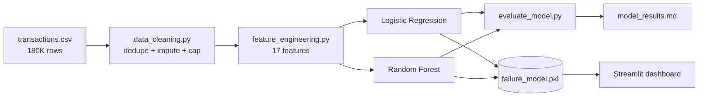

<div align="center">


<br/>


</div>

---

Every failed settlement is a lost sale *and* a frustrated customer. This project predicts **which transactions will fail before they settle**, so a payments team can step in early — step-up authentication, manual review, smarter issuer routing.

## 📦 The data

Synthetic but realistic: 180,600 transactions across all of 2025 (seed 42, fully reproducible), with built-in messiness — missing values and duplicate rows, just like production data.

| | |
|---|---|
| **Rows** | 180,600 |
| **Period** | Jan – Dec 2025 |
| **Failure rate** | 6.08% |
| **Fields** | amount, channel, merchant, device, issuer, latency, account age, velocity, corridor… |
| **Top failure reasons** | insufficient funds · issuer decline · gateway timeout · suspected fraud |

## 🔍 Where failures hide

<details>
<summary><b>Click to expand the EDA story</b></summary>
<br/>


Failures spike at night — the 2–4 AM window fails at nearly **2x** the daytime rate.


Wallets fail most (8.08%), UPI least (5.11%). Gaming merchants are the riskiest category, grocery the safest. One issuer declines noticeably more than peers.

</details>

### ⚡ Risk factors, animated


*Bars animate on load. Every one of these signals beats the 6.08% baseline — slow authorizations (>3s) are the single loudest alarm at 14.2%.*

## 🤖 Model showdown

Two models, one honest test: trained on **Jan–Sep 2025**, evaluated on a strict time-based hold-out (**Oct–Dec 2025**, no leakage). Thresholds tuned on Aug–Sep to maximise F1.


| Model | Threshold | Precision | Recall | F1 | ROC-AUC |
|---|---|---|---|---|---|
| **Logistic Regression** | 0.709 | **0.248** | **0.359** | **0.294** | **0.764** |
| Random Forest | 0.623 | 0.233 | 0.352 | 0.281 | 0.758 |

> **Plot twist:** the simple model wins. The failure drivers combine additively, which is exactly what logistic regression captures — the forest adds complexity without gain. Always benchmark the simple model first. 🤷


*Full numbers live in [`reports/model_results.md`](reports/model_results.md) — reproduced end-to-end by `src/evaluate_model.py`.*

### 🔧 How it all connects



## 🖥️ Try the dashboard

`streamlit run dashboard/app.py` — four pages:

- **Overview** — KPIs, monthly trend, hourly failures
- **Failure patterns** — slice failure rates by channel, category, issuer, corridor
- **Risk scorer** — type in any transaction, get an instant failure probability with plain-English risk flags
- **Model insights** — metrics, ROC, top risk drivers

## 🗂️ Project structure

```
financial-transaction-failure-prediction/
├── data/
│   ├── raw/transactions.csv            # generated dataset
│   └── processed/clean_transactions.csv
├── notebooks/
│   ├── 01_data_generation.ipynb        # build + inspect the dataset ▶ executed
│   ├── 02_eda.ipynb                   # failure-pattern analysis ▶ executed
│   └── 03_model_training.ipynb        # train, compare, interpret ▶ executed
├── visuals/                           # charts + animated SVG for this README
├── src/
│   ├── data_cleaning.py
│   ├── feature_engineering.py
│   ├── train_model.py
│   └── evaluate_model.py              # reproduces reports/model_results.md
├── models/transaction_failure_model.pkl
├── dashboard/app.py
├── reports/model_results.md
├── requirements.txt
└── .gitignore
```

## ▶️ Run it yourself

```bash
pip install -r requirements.txt

python src/data_cleaning.py     # raw -> processed
python src/train_model.py       # train LR + RF, tune threshold, save bundle
python src/evaluate_model.py    # verify metrics -> reports/model_results.md

streamlit run dashboard/app.py  # launch the dashboard
```

Or open the notebooks in order — every cell is already executed with outputs.

## 📝 Notes

- `failure_reason` is **excluded** from modelling — it's only known after the outcome (target leakage).
- Data is synthetic (seed 42) and built for portfolio demonstration.


